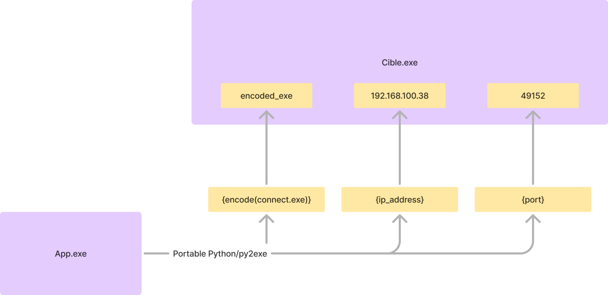
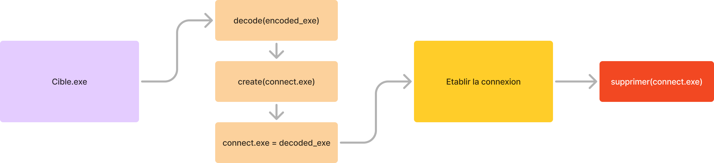

# System Recognition Platform

A platform for collecting system information (Operating System, Battery, Processor, etc.) both locally and remotely.

## Overview

This project implements a desktop application that enables users to gather comprehensive system information through two modes:

1. **Local Recognition**: Directly interrogates the local system to retrieve detailed information.
2. **Remote Recognition**: Establishes a connection to a target system and collects information remotely.

## Features

### Local Recognition
- Operating system identification (name and version)
- Hostname retrieval
- CPU specifications (brand, capacity, cores)
- Memory size information
- Disk partition details
- Connected peripherals (printers, displays, keyboards, mice)
- Battery percentage

### Remote Recognition
The remote recognition works through a socket-based client-server approach:
1. The user (interrogator) generates an executable file containing the IP address and port of their machine

2. This executable is sent to the target system
3. When executed on the target system, it establishes a connection with the user's machine
4. System information is then gathered and sent back to the user

## Technical Details

### Development
- Implemented in Python
- GUI developed using Tkinter
- Utilizes socket communication for remote connections
- Integrates a portable Python interpreter for Windows to ensure standalone functionality

### System Support
- The application primarily supports Windows systems
- Local recognition has cross-platform capabilities with varying levels of information access based on user permissions

### Security Considerations
The project highlights that system security is often compromised due to human error rather than technical vulnerabilities, emphasizing the importance of user education and awareness in cybersecurity strategies.

## Future Improvements
- Simultaneous recognition of multiple remote machines
- Enhanced user interface with visual data representation
- Report generation and data export capabilities
- Extended cross-platform support for Linux and macOS

## Notes
This application was developed as an educational project to understand system interrogation techniques and network communication. The remote recognition feature demonstrates how information can be collected with the target's action (whether conscious or unconscious), highlighting the importance of user vigilance in cybersecurity.
